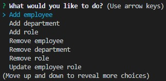
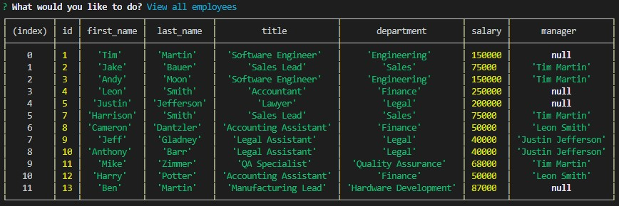

# Employee Database

[](https://opensource.org/licenses/MIT)


## Description
An employee database that allows different employee information to be modified using the command prompt utilizing the inquirer npm package and MySQL.


## Table of Contents
  
  * [Installation](#installation)
  * [Testing](#testing)
  * [Useage](#useage)
  * [Technologies](#technologies)
  * [License](#license)
  * [Contact](#contact)
  * [Links](#links)

  
## Installation

'git clone' from [my repository](https://github.com/TimMartin13/employee-tracker) and then open the terminal window and navigate to the folder that holds the index.js file.  Run 

```
npm i
```
from the terminal window to install the required npm packages (inquirer, mysql).

## Testing

Manual unit testing example shown here:

[](https://drive.google.com/file/d/1_RNYgdkwVy2o4eOFXCrLwoiCi0ps3GAR/view?usp=sharing "Testing with Minnesota Vikings Players")

You can click on the gif or [here](https://drive.google.com/file/d/1_RNYgdkwVy2o4eOFXCrLwoiCi0ps3GAR/view?usp=sharing) to see the test video.

## Useage

Into the terminal window, type

```
node index.js
```
You will then be prompted about what you would like to do. It looks like this:



Choose an option and follow the prompts.  You can view, add, remove, and update (Employees, Managers, Departments, and Roles). If you choose to 'view all employees', you will see a print out to the console window that looks like this:




## Technologies

Javascript, MySQL, node.js, npm packages(inquirer, mysql).


## License


Licensed under the [MIT](https://choosealicense.com/licenses/mit/) license 

## Contact


Email: timmartin13@gmail.com

Github: [TimMartin13](https://github.com/TimMartin13)


## Links

Test Video: [Push me](https://drive.google.com/file/d/1_RNYgdkwVy2o4eOFXCrLwoiCi0ps3GAR/view?usp=sharing)

Repository: https://github.com/TimMartin13/employee-tracker
